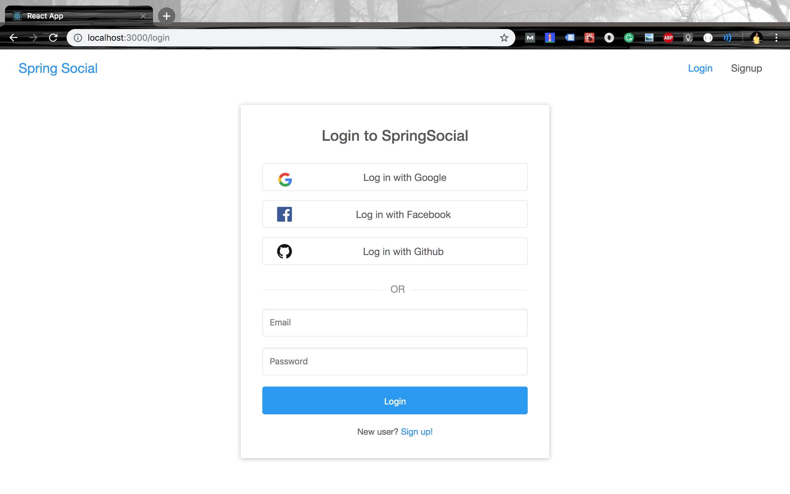

# Spring Boot React OAuth2 Social Login Demo



## Setting up the Backend Server (spring-social)

+ **Create MySQL database**

	```bash
	mysql> create database spring_social
	```

+ **Configure database username and password**

	```yml
	# spring-social/src/main/resources/application.yml
	spring:
	    datasource:
	        url: jdbc:mysql://localhost:3306/spring_social?useSSL=false
	        username: <YOUR_DB_USERNAME>
	        password: <YOUR_DB_PASSWORD>
	```

+ **Specify OAuth2 Provider ClientId's and ClientSecrets**
	
	> This is optional if you're testing the app in localhost. A demo clientId and clientSecret is already specified.

	```yml
    security:
      oauth2:
        client:
          registration:
            google:
              clientId: <GOOGLE_CLIENT_ID>
              clientSecret: <GOOGLE_CLIENT_SECRET>
              redirectUriTemplate: "{baseUrl}/oauth2/callback/{registrationId}"
              scope:
                - email
                - profile
            facebook:
              clientId: <FACEBOOK_CLIENT_ID>
              clientSecret: <FACEBOOK_CLIENT_SECRET>
              redirectUriTemplate: "{baseUrl}/oauth2/callback/{registrationId}"
              scope:
                - email
                - public_profile
            github:
              clientId: <GITHUB_CLIENT_ID>
              clientSecret: <GITHUB_CLIENT_SECRET>
              redirectUriTemplate: "{baseUrl}/oauth2/callback/{registrationId}"
              scope:
                - user:email
                - read:user
          provider:
            facebook:
              authorizationUri: https://www.facebook.com/v3.0/dialog/oauth
              tokenUri: https://graph.facebook.com/v3.0/oauth/access_token
              userInfoUri: https://graph.facebook.com/v3.0/me?fields=id,first_name,middle_name,last_name,name,email,verified,is_verified,picture.width(250).height(250)
	```

	*Please make sure that `http://localhost:8080/oauth2/callback/<provider>`* is added as an authorized redirect uri in the OAuth2 provider. For example, In your [Google API console](https://console.developers.google.com/projectselector/apis/credentials?pli=1), make sure that `http://localhost:8080/oauth2/callback/google` is added in the **Authorized redirect URIs**

	*Also, make sure that the above mentioned scopes are added in the OAuth2 provider console.*	For example, scope `email` and `profile` should be added in your Google project's OAuth2 consent screen.

+ **Run spring-social**

	```bash
	mvn spring-boot:run
	```

## Setting up the Frontend Server (react-social)

```bash
cd react-social
npm install && npm start
```